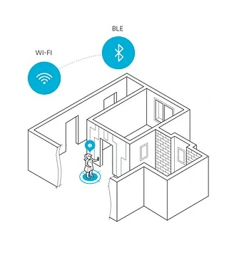

# KeyBt
El uso principal de un dispositivo KeyBt es detectar la presencia de un **boton/llavero** bluetooth para control de accesos.
La base de los dispositovs es el ESP32 ya que, al contrario que el ESP8266, disponen de la facilidad Bluetooth incorporada.
El principio de funcionamiento es muy sencillo, el usuario porta un **boton/llavero** con el modulo nRF52810 o similar. En circunstancias normales el usuario se encuentra en el domicilio, el módulo **KeyBt** tiene registrado el botón como localizado. Si el usuario abandona el domicilio el módulo **KeyBt** detecta que el **boton/llavero** deja de estar en su radio de detección, hay un cambio de estado y actua en consecuencia mandando mensaje a otro elemento de Serverpic, ejecutando comandos de Serverpic o cualquier otra acción que se le indique, por ejemplo, conectar un PIR.
El usuario regresa al domicilio, el módulo **KeyBt** detecta la presencia del **boton/llavero**, se produce un cambio de estado y desencadena las acciones programadas.



Como que un domiclio normalmente tiene varios convivientes y cada uno tendrá su  **boton/llavero**, aunque el sistema detecte que un elemento abandona el domicilio no debe desencadenar las acciones asignadas a la ausencia de **boton/llavero** mientras se detecte la existencia de al menos uno. Por otro lado cada conviviente, en el domicilio depositará su **boton/llavero** en una estancia distinta dentro de la casa por lo que el sistema se complica.

Para garantizar que el sistema detecta la existencia de al menos un **boton/llavero** en la vivienda será necesario varios dispositivos, uno de ellos será el **Maestro** que se intentará ubicar en la entrada de la casa y el resto serán **Excalvos** y se distribuiran en la vivienda dando cobertura de detección a todas las estancias.

Los **Excalvos** deberán comunicar al **Maestro** si en su radio de detección se encuentra algun **boton/llavero**, con esa información y con la propia del **Maestro**, este decidirá si hay un cambio de estado de **Ausencia** a **Presencia** o viceversa.

Aunque el software de **Maestros** y **Exclavos** tendran fucniones comunes si que tendrán ciertas particularidades. De entrada tiene que haber unas reglas para denominar los dispositivos, los **Exclavos** tendrán el mismo nombre y cada uno de ellos se diferenciará terminando el nombre en **_n** siendo n el número de **Exclavo**, el **Maestro** tendrá el mismo nombre que los exclavos pero acabado en **_m**. Los **Exclavos**, cuando cargan sus parametros particulares determinarán el nombre del **Maestro** quitabndo a su nombre la terminación **_n** y añadiendole la del **Maestro** **_m**.

Por ejemplo supongamos un sistema de un **Maestro** y dos **Exclavos**, los nombres podrian ser repectivamente **BLELleida_m**, **BLELleida_1** y **BLELleida_2**

El código sería el siguiente

```
                DataConfig aCfg = EpromToConfiguracion ();                                //Leemos la configuracin de la EEprom
                char USUARIO[1+aCfg.Usuario.length()]; 
                (aCfg.Usuario).toCharArray(USUARIO, 1+1+aCfg.Usuario.length());          //Almacenamos en el array USUARIO el nombre de usuario 
                cDispositivo = USUARIO;
                lHomeKit = aCfg.lHomeKit;
                lWebSocket = aCfg.lWebSocket;
                lEstadisticas = aCfg.lEstadisticas;
                #ifdef KeySlave                                                         //Si es exclavo, determinamos el nombre del maestro  
                  if ( (cDispositivo).indexOf("_") > 0  )
                  { 
                    int nPos_ = (cDispositivo).indexOf("_");
                    cDispositivoRemoto = ((cDispositivo).substring(0, nPos_))+"m";
                   }
                #endif  
```

Las ordenes a los dispositivos son las siguientes

Para todos los dispositivos

```
    GetKey.- Devuelve la presencia o no de un boton/llavero segun los siguientes estados
             Maestro.- Key detectado en esta baliza
                       Key no detectado en esta baliza pero si en una remota
                       Key no detectado en el sistema
             Exclavo.- Key detectado en esta baliza
                       Key no detectado en esta baliza

```

Para los **Maestros**

```
    KeyOn.- Con este comando, un Exclavo notifica al Maestro la presencia de un boton/llavero en su radio de detección
    KeyOff.-  Con este comando, un Exclavo notifica al Maestro la usencia de un boton/llavero en su radio de detección
```
